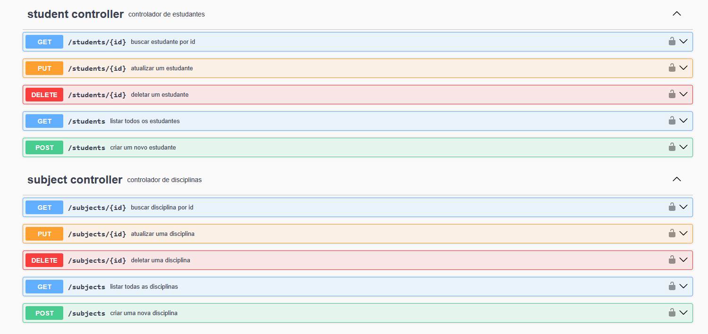
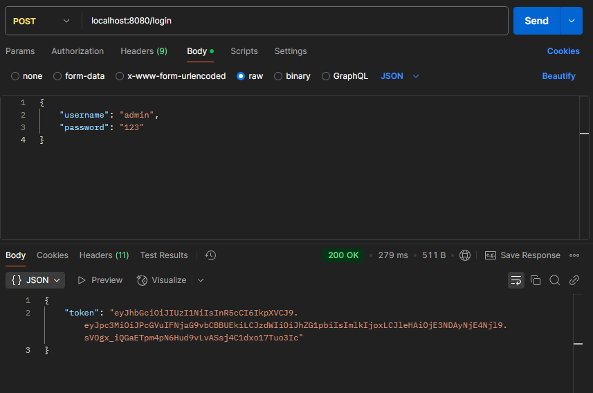

<h1 align="center">🎓 OpenSchool 🎓</h1>
 
OpenSchool API é um serviço web RESTful construído com Spring Boot para gerenciar dados escolares, incluindo estudantes, professores e disciplinas. A API fornece endpoints para operações CRUD, paginação e validação.
 

## Sumário

- [Tecnologias](#tecnologias)
- [Instalação](#instalação)
- [Documentação da API](#documentação)

## Documentação

  
<b>Endpoints</b>

  
  

  
<b>Autenticação</b>

  

 

A documentação local completa da API está disponível [aqui](http://localhost:8080/swagger-ui/index.html#/) quando a aplicação estiver em execução.

## Tecnologias

- Java
- Spring Boot
- PostgreSQL
- Maven
- Flyway Migrations
- Spring Security
- Swagger (Spring Doc)
- JWT
- Lombok

## Instalação

### Pré-requisitos

- Java 17 ou superior
- Maven 3.6.0 ou superior

### Configuração e execução

1. Clone o repositório
2. Instale as dependências com Maven
3. Crie a base de dados PostgreSQL de acordo com o `application.yml`
4. Execute `Application.java`

A aplicação estará disponível em `http://localhost:8080`.

 

